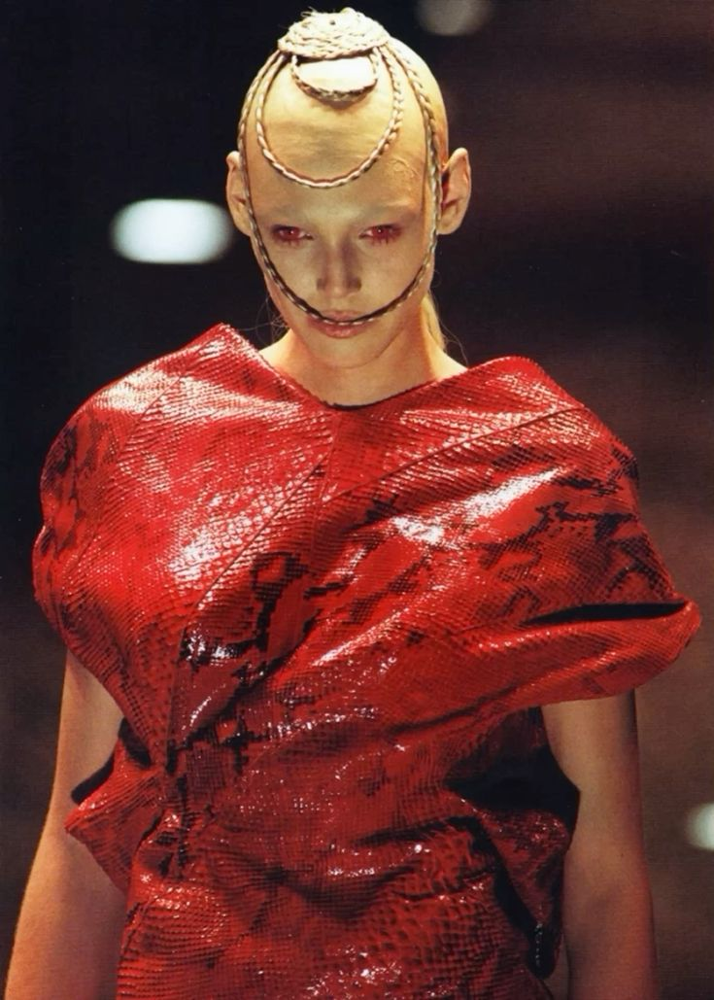

# Javiera Alvear S

Diseñadora industrial, UDP

**Hoy_** Docente y coordinación académica, diseño gráfico, Facultad de Diseño. 

**Qué me gustaría aprender en este curso_**  plataformas reactivas a estímulos externos. Cámara > Audio > Sonidos, etc

## intereses

- Dirección creativa.
- Moda y contracultura. Música y cine.
- Inmersividad y experiencias sensoriales

## pregunta exploratoria

Escribe una pregunta pequeña que pueda transformarse en reglas, datos, geometría, imágenes o interacción.

## algo que me inspira

## Links

- [Referencia 1](https://example.com)
- [Referencia 2](https://example.com)

> No es necesario publicar información personal que no quieras compartir. Este README será parte de un repositorio público durante el laboratorio.
